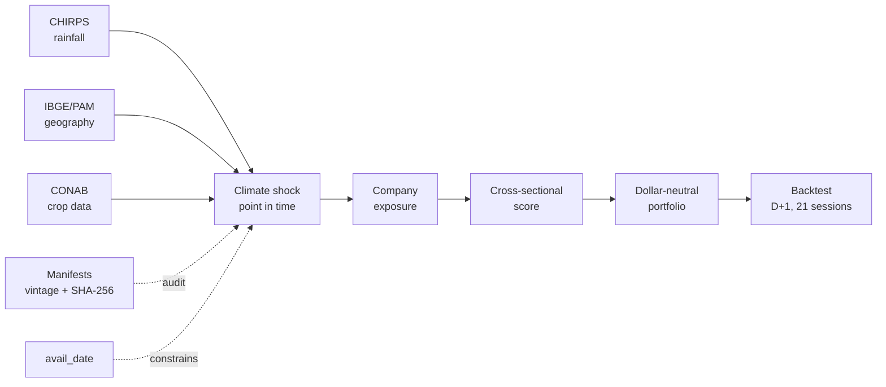

<p align="right"><a href="README.md">Português</a></p>

<p align="center">
  
</p>

<h1 align="center">SERIEMA</h1>

<p align="center">
  <strong>From signal to portfolio.</strong><br>
  Climate shocks, agricultural geography and Brazilian equities — with no shortcuts through time.
</p>

<p align="center">
  <a href="https://github.com/out-of-sample/Quant-AI-Itau-2026/actions/workflows/ci.yml"></a>
  
  <a href="LICENSE"></a>
  
</p>

> [!IMPORTANT]
> This is an academic research artifact, not investment advice or a live trading system. Its
> negative result against the benchmark is part of the conclusion.

## In one sentence

SERIEMA combines satellite rainfall, agricultural geography, crop calendars and corporate
exposures to test whether local climate information reaches agribusiness equities before it is
consolidated in Brazil's national CONAB crop reports.

The proposed inefficiency concerns **aggregation, not access**: the inputs are public; the work
lies in joining weather grids × producing municipalities × crop years × companies without using
information that was unavailable at decision time.

## Sealed result

The design was frozen before the 2020/21–2024/25 holdout and executed once on 27 July 2026.
The strategy ended with a positive nominal return but failed to compensate risk relative to its
pre-declared benchmark.

| Test or metric | Result | Permitted interpretation |
|---|---:|---|
| Primary H′ test, exact one-sided permutation | `p = 0.0625` | OOS evidence for the strategy |
| Net nominal return | **+16.97%** | positive OOS P&L |
| Local risk-free return over the same period | **+63.31%** | the portfolio lost to cash |
| Excess Sharpe | **−0.50** | no evidence of skill |
| Alpha after factors, FX, commodities and ONI | `t = −1.03` | climate-alpha claim rejected |
| Maximum drawdown | **−20.92%** | material risk for a low return |

<p align="center">
  <a href="docs/assets/readme/resultado-holdout.png">
    
  </a>
</p>

<p align="center"><em>The signal passed. The portfolio gained — but cash gained more.</em></p>

The five-page visual report is available in Portuguese at
[`report/relatorio-seriema.pdf`](report/relatorio-seriema.pdf). The sealed numerical record is
[`data/reference/holdout_result_v1.json`](data/reference/holdout_result_v1.json).

## How the strategy works



The first four stages produce a number by crop and region; the exposure matrix maps it to five
eligible companies. The engine then enforces the historical universe, liquidity, costs, stock
borrowing, name caps and next-session execution. The full specification is in
[`docs/04_PROTOCOLO_BACKTEST.md`](docs/04_PROTOCOLO_BACKTEST.md) (Portuguese).

## What makes the experiment auditable

- **Point in time by construction.** Every decision filters on `avail_date`, not merely
  `ref_date`; sources that rewrite history have explicit vintage handling.
- **Falsifiable hypotheses.** The original thesis failed in development and was not silently
  inverted. The later quantity-dominant hypothesis was registered as a new one.
- **One-shot holdout.** Code, sources and six inputs were hashed before evaluation; both the
  failed operational attempt and the sealed execution remain in the record.
- **Visible negative findings.** Positive nominal P&L is not called alpha. Concentration,
  drawdown, multiple testing and the risk-free comparison are reported.
- **603 automated tests.** CI combines `pytest`, Ruff and project-specific lookahead and secret
  guards.

## Reproduce and verify

CPython 3.14 is required. Exact runtime and tooling versions are locked with hashes.

```bash
python3.14 -m venv .venv
source .venv/bin/activate
python -m pip install --require-hashes -r requirements.lock
python -m pip install -e . --no-deps
python scripts/quality.py
```

`scripts/quality.py` runs lint, formatting, deterministic guards and the test suite. Raw and
intermediate data are not versioned; manifests, hashes and compact reference artifacts are.
[`REPRODUCING.md`](REPRODUCING.md) states precisely what can be reproduced from a clone and
what requires the archived snapshots.

## Repository map

```text
.
├── src/quantagro/       ingestion → validation → features → signal → backtest
├── tests/               603 tests, including PIT and sealed-holdout invariants
├── scripts/             executable pipelines and quality guards
├── data/manifests/      capture and vintage evidence
├── data/reference/      small immutable contracts and results
├── docs/                thesis, data, architecture, decisions, risks and GenAI log
├── report/              final five-page report
└── requirements.lock    fully hashed environment
```

The canonical technical documentation is in Portuguese. Start with
[`docs/00_PLANO_MESTRE.md`](docs/00_PLANO_MESTRE.md), then use:

| Topic | Document |
|---|---|
| thesis, reformulation and preregistration | [`docs/01_TESE_E_PRE_REGISTRO.md`](docs/01_TESE_E_PRE_REGISTRO.md) |
| sources, latency and vintage | [`docs/02_DADOS.md`](docs/02_DADOS.md) |
| pipeline architecture | [`docs/03_ARQUITETURA.md`](docs/03_ARQUITETURA.md) |
| execution and backtest | [`docs/04_PROTOCOLO_BACKTEST.md`](docs/04_PROTOCOLO_BACKTEST.md) |
| robustness and placebos | [`docs/05_SUITE_ROBUSTEZ.md`](docs/05_SUITE_ROBUSTEZ.md) |
| critique, limitations and decisions | [`docs/06_CRITICA_ADVERSARIAL.md`](docs/06_CRITICA_ADVERSARIAL.md) · [`docs/07_RISCOS_E_DECISOES.md`](docs/07_RISCOS_E_DECISOES.md) |
| SERIEMA identity | [`docs/08_IDENTIDADE.md`](docs/08_IDENTIDADE.md) |
| concrete use of generative AI | [`docs/DIARIO_GENAI.md`](docs/DIARIO_GENAI.md) |

## Data and reproducibility boundaries

Raw B3, CHIRPS, CONAB, IBGE/PAM, ComexStat, NEFIN, FRED, IPEA and ONI data stay outside Git
because of size, redistribution terms and vintage preservation. The repository versions the
ingestion code and the manifests identifying each capture. This makes the experiment auditable,
but does not imply every provider will continue serving the same historical file. See
[`docs/02_DADOS.md`](docs/02_DADOS.md).

## Contributions, security and license

Contributions must preserve the sealed artifacts, include tests and declare any point-in-time
impact. See [`CONTRIBUTING.md`](CONTRIBUTING.md). Report vulnerabilities through
[`SECURITY.md`](SECURITY.md); never place credentials or sensitive data in a public issue.

Original code and materials in this repository are available under
[`Apache-2.0`](LICENSE). This does not relicense third-party data, names or marks referenced by
the project. The software is provided without warranty and is not financial advice.
