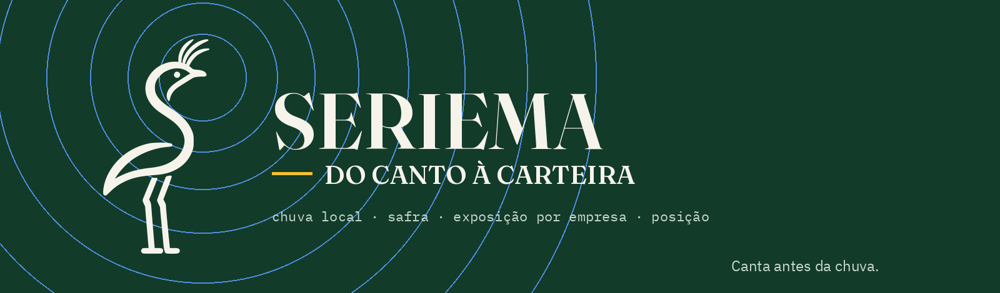
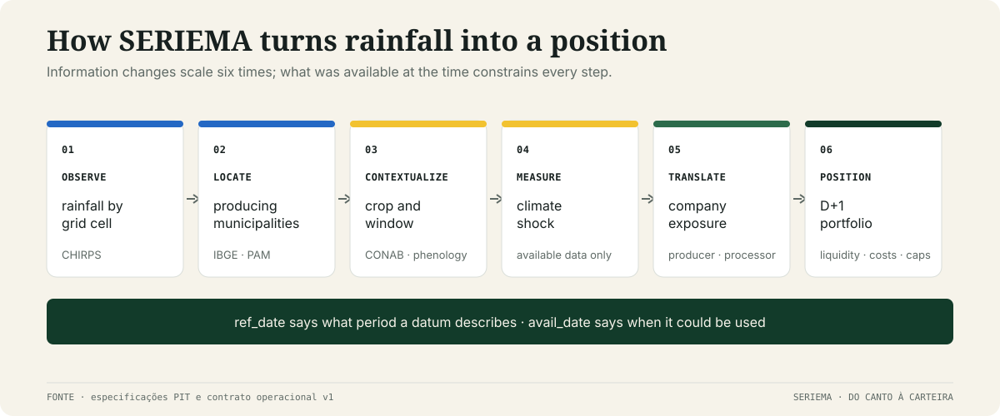
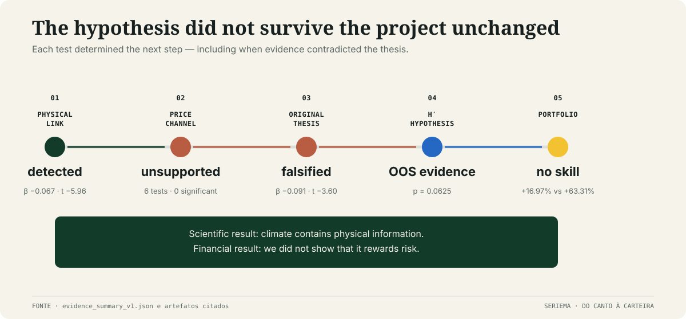
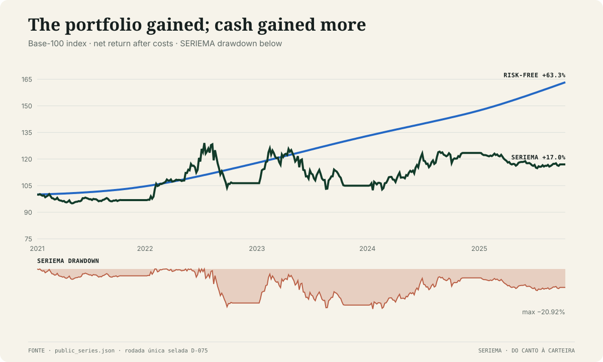
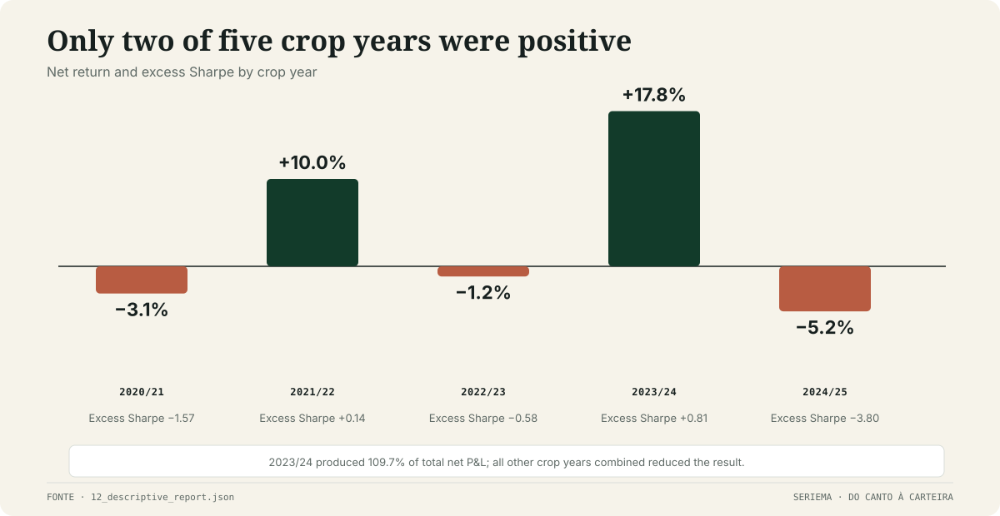

<p align="right"><a href="README.md">Português</a></p>

<p align="center">
  
</p>

<p align="center">
  <strong>An experiment about the interval between rainfall that has already happened and a crop report that has not.</strong>
</p>

<p align="center">
  <a href="report/relatorio-seriema.pdf">Final report</a> ·
  <a href="results/README.md">Results atlas</a> ·
  <a href="docs/README.md">Documentation</a> ·
  <a href="REPRODUCING.md">Reproducibility</a>
</p>

## The question

Rainfall changes a crop before it changes the report. SERIEMA investigates whether local climate
observations can be assembled, matched to producing regions, and translated into positions in
Brazilian agribusiness equities **before** CONAB's national revision consolidates that information.

The data are public. The potential inefficiency is not access to an exclusive satellite; it is the
aggregation the market may not have completed: rainfall × municipality × crop × calendar × company.

The name comes from the Brazilian seriema, a Cerrado bird whose call, in rural tradition, announces
rain. The strategy inherits the attention to climate — not folklore as evidence. The editorial title,
**DO CANTO À CARTEIRA** (“from call to portfolio”), describes the path the project attempts to
complete.

## From observation to decision



Data can only advance through the pipeline when they were already available. Every table therefore
separates the period an observation describes (`ref_date`) from the date on which it became public
(`avail_date`). Sources that rewrite history are also tied to the vintage actually captured.

The core economics are simple. A crop failure reduces quantity; at the same time, lower supply may
raise prices. The project had to learn which force dominates a producer's equity — not assume the
answer.

## The investigation changed direction



First, the rainfall shock anticipated CONAB revisions. Then, six specifications failed to establish
that prices offset the crop loss. When the original direction — buying producers — was tested in
development, it was **anti-predictive**.

The project did not silently flip the sign. The original thesis remains recorded as falsified, and a
new hypothesis, H′, was pre-declared: quantity damage dominates; exposed producers are short and
processors are long. Sugarcane enters through a separate mechanism and with limited weight.

This sequence is the scientific core of the repository. Intermediate tests and numbers live in the
[`results atlas`](results/README.md); original preregistrations and decisions remain in the
[`research history`](docs/history/README.md).

## The final test

H′, the portfolio mechanics, and six inputs were frozen before the 2020/21–2024/25 holdout. The run
was executed **once**, on July 27, 2026: five crop years, 46 decisions, D+1 execution, liquidity,
trading costs, and stock-borrow costs.

The primary test passed (`p = 0.0625`, one-sided exact permutation at 10%). The portfolio also
finished positive. But the financial question is more demanding than “did it make money?”

## The result, without spin



| | SERIEMA | Risk-free |
|---|---:|---:|
| cumulative return | **+16.97%** | **+63.31%** |
| excess Sharpe | **−0.50** | — |
| maximum drawdown | **−20.92%** | — |

Spanning against factors, FX, commodities, and ONI produced an arithmetic annualized alpha of
−5.99%, with `t = −1.03`. Therefore:

- there is **out-of-sample evidence for the strategy** and **positive out-of-sample P&L**;
- there is no evidence of **climate alpha**;
- there is no evidence of **skill against the benchmark**.

In short: the signal passed and the portfolio gained, but the risk was not rewarded relative to cash.

## What lies behind the aggregate number



Only two of five crop years were positive. 2023/24 generated 109.7% of total net P&L; the other four
combined reduced the result. Costs consumed 12.59 percentage points of return, BRFS3 concentrated
67% of gross P&L, and delaying the signal to 14 days produced a −8.51% return.

These weaknesses are not footnotes. The Portuguese-language
[`results atlas`](results/README.md) opens up:

- H1, H2, and the falsification of the original thesis, test by test;
- crop years, risk, costs, and liquidity;
- ADTV, cap, holding-period, and lag sensitivities;
- leave-one-name-out and leave-one-year-out;
- attribution, sector-versus-climate decomposition, placebos, and multiple testing;
- the exact JSON/CSV artifacts and the script behind each figure.

## What we learned

Local climate contained physical information about the crop before the aggregate revision. Turning
that information into an equity advantage was much harder: the price channel did not hold, the first
direction failed, and the final portfolio did not beat its opportunity cost.

That outcome does not make the experiment empty. It separates three claims quantitative projects
often blur: **there is a signal**, **there is P&L**, and **there is skill**. SERIEMA supports the first
two, not the third.

## What comes next

The next cycle does not rerun the same backtest with different parameters — that would only spend
degrees of freedom on an already-used sample. It changes the question, across three experiments:

1. **Separate local from national.** The spatial placebo revealed a strong national-common
   component: shuffling states destroys ~69% of β, yet ~31% survives. Removing that component and
   trading only the per-company geographic residual attacks both the spatial placebo and the sector
   beta that dominated P&L.
2. **Make exposure live.** The `E` matrix is currently fixed on sparse vintages. Rebuilding it from
   geography, mix, own production, hedging and inputs read out of point-in-time CVM/SEC filings
   turns exposure from a constant into a variable — which is where a fine cross-section could exist.
3. **Trade the event, not the calendar.** Replace the fixed 21-session block with pre-registered
   windows spanning anomaly, nowcast, CONAB release and dissipation. The lag sensitivity (14 days
   took the return to −8.51%) says timing carries the result; so timing must be a hypothesis, not a
   convention.

**The decision rule is strict: a new design requires a new holdout.** 2020–2025 has been spent and
does not become evidence again. The next seal decides among three destinations — demonstrated alpha
→ capital; mechanism only → risk overlay; neither → close the research line.

## Choose your depth

| If you want to… | Start here |
|---|---|
| read the five-page visual summary | [`report/relatorio-seriema.pdf`](report/relatorio-seriema.pdf) |
| inspect every result and sensitivity | [`results/README.md`](results/README.md) |
| understand the economic rule | [`docs/methodology/strategy.md`](docs/methodology/strategy.md) |
| audit data, vintages, and availability | [`docs/methodology/data.md`](docs/methodology/data.md) |
| review execution and backtesting | [`docs/methodology/backtest.md`](docs/methodology/backtest.md) |
| trace preregistrations and decisions | [`docs/history/README.md`](docs/history/README.md) |
| understand the name and visual identity | [`docs/identity.md`](docs/identity.md) |
| verify the use of generative AI | [`docs/genai.md`](docs/genai.md) |

## Reproduce and verify

Only now do environment instructions enter the story: they matter for auditability, but they are not
the project's introduction.

```bash
python3.14 -m venv .venv
source .venv/bin/activate
python -m pip install --require-hashes -r requirements.lock
python -m pip install -e . --no-deps
python scripts/quality.py
```

A clean clone verifies the software, contracts, compact results, and manifests. Bit-for-bit
reproduction requires the archived point-in-time snapshots, which are not redistributed because of
size, provider terms, and vintage preservation. The exact boundary is documented in
[`REPRODUCING.md`](REPRODUCING.md).

<p align="center">
  <a href="https://github.com/out-of-sample/Quant-AI-Itau-2026/actions/workflows/ci.yml"></a>
  
  <a href="LICENSE"></a>
  
</p>

Original code and materials are released under [`Apache-2.0`](LICENSE). The license does not grant
rights to third-party data or trademarks. This is an academic research artifact, not investment
advice or a live execution system.
