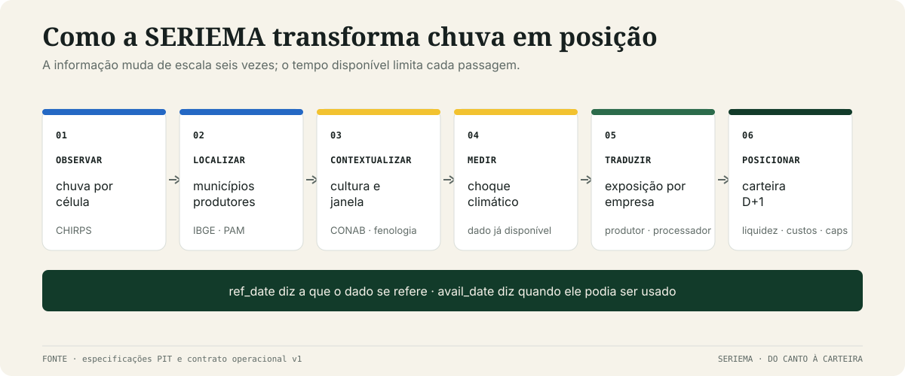

<p align="right"><a href="README.en.md">English</a></p>

<p align="center">
  
</p>

<p align="center">
  <strong>Um experimento sobre o intervalo entre a chuva que já caiu e o boletim que ainda não saiu.</strong>
</p>

<p align="center">
  <a href="report/relatorio-seriema.pdf">Relatório final</a> ·
  <a href="results/README.md">Atlas de resultados</a> ·
  <a href="docs/README.md">Documentação</a> ·
  <a href="REPRODUCING.md">Reprodução</a>
</p>

## A pergunta

A chuva muda a safra antes de mudar o boletim. A SERIEMA investiga se observações climáticas
locais podem ser reunidas, associadas às regiões produtoras e traduzidas em posição sobre ações do
agronegócio **antes** de a revisão nacional da CONAB consolidar essa informação.

Os dados são públicos. A possível ineficiência não está em possuir um satélite exclusivo, mas em
fazer a agregação que o mercado talvez ainda não tenha feito: chuva × município × cultura ×
calendário × empresa.

O nome vem da ave do Cerrado cujo canto, na tradição rural, anuncia chuva. O robô herda a atenção
ao clima — não a crença como evidência. E o título editorial, **DO CANTO À CARTEIRA**, descreve o
caminho que o projeto tenta completar.

## Da observação à decisão



O dado só pode avançar quando já estava disponível. Por isso cada tabela separa a data a que a
observação se refere (`ref_date`) da data em que ela se tornou pública (`avail_date`). Fontes que
reescrevem o passado também são presas ao vintage realmente capturado.

O núcleo econômico é simples. Uma quebra de safra reduz quantidade; ao mesmo tempo, menor oferta
pode elevar preço. O projeto precisava descobrir qual força domina na ação do produtor — e não
presumir a resposta.

## A investigação mudou de direção


Primeiro, o choque de chuva antecipou revisões da CONAB. Depois, seis especificações não
estabeleceram que o preço compensava a quebra. Quando a direção original — comprar produtores — foi
testada no desenvolvimento, ela foi **antipreditiva**.

O projeto não inverteu silenciosamente o sinal. A tese original ficou registrada como falsificada
e uma nova hipótese, H′, foi pré-declarada: o dano de quantidade domina; produtores expostos ficam
vendidos e processadores, comprados. Cana entra por um mecanismo separado e com peso limitado.

Essa sequência é o coração científico da repo. Os números e testes intermediários estão no
[`atlas`](results/README.md#1-como-a-evidência-evoluiu); o pré-registro e as decisões originais,
na [`trilha histórica`](docs/history/README.md).

## O teste final

H′, a mecânica da carteira e os seis inputs foram congelados antes do holdout 2020/21–2024/25. A
rodada foi executada **uma única vez**, em 27/07/2026: cinco anos-safra, 46 decisões, execução D+1,
liquidez, custos e aluguel.

O teste primário passou (`p = 0,0625`, permutação exata unilateral a 10%). A carteira também
terminou positiva. Mas a pergunta financeira é mais exigente do que “ganhou dinheiro?”.

## O resultado sem maquiagem


| | SERIEMA | Livre de risco |
|---|---:|---:|
| retorno acumulado | **+16,97%** | **+63,31%** |
| Sharpe de excesso | **−0,50** | — |
| drawdown máximo | **−20,92%** | — |

O spanning com fatores, câmbio, commodities e ONI encontrou alpha anualizado aritmético de
−5,99%, com `t = −1,03`. Portanto:

- há **evidência OOS da estratégia** e **P&L OOS positivo**;
- não há evidência de **alpha climático**;
- não há evidência de **habilidade contra o benchmark**.

Em outras palavras: o sinal passou, a carteira ganhou, mas o risco não foi remunerado frente ao
caixa.

## O que existe por trás do número agregado


Somente duas das cinco safras foram positivas. 2023/24 respondeu por 109,7% do P&L líquido total;
as outras quatro, juntas, reduziram o resultado. Custos consumiram 12,59 pontos percentuais de
retorno, BRFS3 concentrou 67% do P&L bruto e atrasar o sinal para 14 dias levou o retorno a −8,51%.

Essas fragilidades não ficam em nota de rodapé. O
[`atlas de resultados`](results/README.md) abre:

- H1, H2 e a falsificação da tese original, teste por teste;
- safras, risco, custos e liquidez;
- sensibilidades de ADTV, caps, holding e lag;
- leave-one-name-out e leave-one-year-out;
- atribuição por ação, decomposição setor × clima, placebos e múltiplas tentativas;
- os JSON/CSV exatos e o script que gera cada figura.

## O que aprendemos

O clima local carregou informação física sobre a safra antes da revisão agregada. Converter essa
informação em vantagem acionária foi muito mais difícil: o canal de preço não se sustentou, a
primeira direção morreu e a carteira final não superou o custo de oportunidade.

Esse desfecho não torna o experimento vazio. Ele separa três afirmações que projetos quantitativos
frequentemente confundem: **há sinal**, **há P&L** e **há habilidade**. Na SERIEMA, as duas primeiras
têm suporte; a terceira, não.

## Escolha a profundidade

| Se você quer… | Comece aqui |
|---|---|
| ver a síntese visual de cinco páginas | [`report/relatorio-seriema.pdf`](report/relatorio-seriema.pdf) |
| conferir todos os resultados e sensibilidades | [`results/README.md`](results/README.md) |
| entender a regra econômica | [`docs/methodology/strategy.md`](docs/methodology/strategy.md) |
| auditar dados, vintage e disponibilidade | [`docs/methodology/data.md`](docs/methodology/data.md) |
| revisar execução e backtest | [`docs/methodology/backtest.md`](docs/methodology/backtest.md) |
| acompanhar pré-registros e decisões | [`docs/history/README.md`](docs/history/README.md) |
| entender nome e identidade visual | [`docs/identity.md`](docs/identity.md) |
| verificar o uso de IA generativa | [`docs/genai.md`](docs/genai.md) |

## Reproduzir e verificar

Só agora entram as instruções de ambiente: elas são importantes para auditoria, mas não são a
história do projeto.

```bash
python3.14 -m venv .venv
source .venv/bin/activate
python -m pip install --require-hashes -r requirements.lock
python -m pip install -e . --no-deps
python scripts/quality.py
```

Um clone limpo verifica o software, os contratos, os resultados compactos e os manifestos. A
reprodução bit a bit exige os snapshots point-in-time arquivados, que não são redistribuídos por
tamanho, termos das fontes e preservação de vintage. A fronteira completa está em
[`REPRODUCING.md`](REPRODUCING.md).

<p align="center">
  <a href="https://github.com/out-of-sample/Quant-AI-Itau-2026/actions/workflows/ci.yml"></a>
  
  <a href="LICENSE"></a>
  
</p>

O código e os materiais originais são disponibilizados sob
[`Apache-2.0`](LICENSE). A licença não transfere direitos sobre dados ou marcas de terceiros. Este
é um artefato acadêmico de pesquisa, não recomendação de investimento nem sistema de execução ao
vivo.
