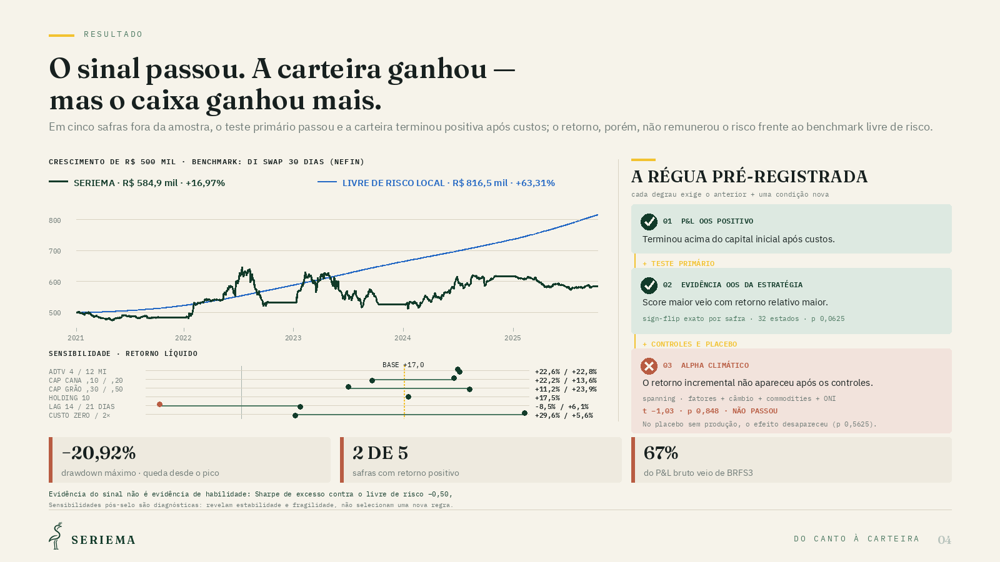
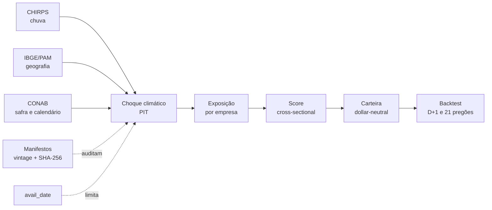

<p align="right"><a href="README.en.md">English</a></p>

<p align="center">
  
</p>

<h1 align="center">SERIEMA</h1>

<p align="center">
  <strong>Do canto à carteira.</strong><br>
  Choque climático, geografia agrícola e ações brasileiras — sem atalhos no tempo.
</p>

<p align="center">
  <a href="https://github.com/out-of-sample/Quant-AI-Itau-2026/actions/workflows/ci.yml"></a>
  
  <a href="LICENSE"></a>
  
</p>

> [!IMPORTANT]
> Este é um artefato acadêmico de pesquisa, não uma recomendação de investimento nem um
> sistema de execução ao vivo. O resultado negativo contra o benchmark faz parte da conclusão.

## Em uma frase

A SERIEMA combina chuva observada por satélite, geografia de produção, calendário fenológico e
exposição das empresas para investigar se informação climática local chega às ações do
agronegócio antes de aparecer consolidada nos boletins nacionais da CONAB.

A ineficiência proposta é de **agregação, não de acesso**: os dados são públicos; o trabalho está
em cruzar grade meteorológica × municípios produtores × safras × empresas sem usar informação
que ainda não estava disponível na data da decisão.

## Resultado selado

O desenho foi congelado antes do holdout 2020/21–2024/25 e executado uma única vez em
27/07/2026. A estratégia terminou positiva, mas não remunerou o risco frente ao benchmark
pré-declarado.

| Teste ou métrica | Resultado | Leitura permitida |
|---|---:|---|
| Teste primário H′, permutação exata unilateral | `p = 0,0625` | evidência OOS da estratégia |
| Retorno líquido nominal | **+16,97%** | P&L OOS positivo |
| Livre de risco local no mesmo intervalo | **+63,31%** | a carteira perdeu para o caixa |
| Sharpe de excesso | **−0,50** | sem evidência de habilidade |
| Alpha após fatores, câmbio, commodities e ONI | `t = −1,03` | claim de alpha climático vetada |
| Drawdown máximo | **−20,92%** | risco relevante para retorno baixo |

<p align="center">
  <a href="docs/assets/readme/resultado-holdout.png">
    
  </a>
</p>

<p align="center"><em>O sinal passou. A carteira ganhou — mas o caixa ganhou mais.</em></p>

O relatório visual completo tem cinco páginas e está em
[`report/relatorio-seriema.pdf`](report/relatorio-seriema.pdf). A trilha numérica selada vive em
[`data/reference/holdout_result_v1.json`](data/reference/holdout_result_v1.json).

## Como a estratégia funciona



As quatro primeiras etapas devolvem um número por cultura e região; a matriz de exposição o
traduz para cinco empresas elegíveis. O motor então aplica universo histórico, liquidez,
custos, aluguel, limites por ativo e execução no pregão seguinte. A especificação completa
está em [`docs/04_PROTOCOLO_BACKTEST.md`](docs/04_PROTOCOLO_BACKTEST.md).

## O que torna o experimento auditável

- **Point-in-time por construção.** Toda decisão filtra por `avail_date`, nunca apenas por
  `ref_date`; fontes que reescrevem o passado têm tratamento de vintage explícito.
- **Hipóteses falsificáveis.** A tese original falhou no desenvolvimento e não foi
  silenciosamente invertida. A hipótese Q-dominante posterior foi registrada como nova.
- **Holdout de tiro único.** Código, fontes e seis inputs foram presos por hash antes da
  avaliação; a tentativa operacional perdida e a execução selada permanecem registradas.
- **Resultados negativos visíveis.** P&L nominal positivo não é chamado de alpha. Concentração,
  drawdown, múltiplas tentativas e comparação com o livre de risco são reportados.
- **603 testes automatizados.** A CI combina `pytest`, Ruff e guards próprios contra lookahead
  e segredos.

## Reproduzir e verificar

Requer CPython 3.14. As versões exatas, inclusive ferramentas, estão travadas com hashes.

```bash
python3.14 -m venv .venv
source .venv/bin/activate
python -m pip install --require-hashes -r requirements.lock
python -m pip install -e . --no-deps
python scripts/quality.py
```

`scripts/quality.py` executa lint, formatação, guards determinísticos e a suíte de testes. Os dados
brutos e intermediários não são versionados; os manifestos, hashes e artefatos de referência
são. O que pode ser reproduzido apenas com o clone e o que exige os snapshots arquivados está
descrito sem ambiguidade em [`REPRODUCING.md`](REPRODUCING.md).

## Mapa do repositório

```text
.
├── src/quantagro/       ingestão → validação → features → sinal → backtest
├── tests/               603 testes, incluindo invariantes PIT e do holdout
├── scripts/             pipelines executáveis e guards de qualidade
├── data/manifests/      prova de captura e vintage das fontes
├── data/reference/      contratos e resultados pequenos, imutáveis e auditáveis
├── docs/                tese, dados, arquitetura, decisões, riscos e GenAI
├── report/              relatório final de cinco páginas
└── requirements.lock    ambiente integral com hashes
```

Comece por [`docs/00_PLANO_MESTRE.md`](docs/00_PLANO_MESTRE.md). Para uma leitura direcionada:

| Quero entender… | Documento |
|---|---|
| hipótese, reformulação e pré-registro | [`docs/01_TESE_E_PRE_REGISTRO.md`](docs/01_TESE_E_PRE_REGISTRO.md) |
| fontes, latências e vintage | [`docs/02_DADOS.md`](docs/02_DADOS.md) |
| arquitetura do pipeline | [`docs/03_ARQUITETURA.md`](docs/03_ARQUITETURA.md) |
| execução e backtest | [`docs/04_PROTOCOLO_BACKTEST.md`](docs/04_PROTOCOLO_BACKTEST.md) |
| robustez e placebos | [`docs/05_SUITE_ROBUSTEZ.md`](docs/05_SUITE_ROBUSTEZ.md) |
| crítica, limitações e decisões | [`docs/06_CRITICA_ADVERSARIAL.md`](docs/06_CRITICA_ADVERSARIAL.md) · [`docs/07_RISCOS_E_DECISOES.md`](docs/07_RISCOS_E_DECISOES.md) |
| identidade SERIEMA | [`docs/08_IDENTIDADE.md`](docs/08_IDENTIDADE.md) |
| uso concreto de IA generativa | [`docs/DIARIO_GENAI.md`](docs/DIARIO_GENAI.md) |

## Dados e limites de reprodução

Dados brutos de B3, CHIRPS, CONAB, IBGE/PAM, ComexStat, NEFIN, FRED, IPEA e ONI permanecem
fora do Git por tamanho, termos de redistribuição e preservação de vintage. O repositório
versiona o código de ingestão e os manifestos que identificam cada captura. Isso permite
auditar o experimento, mas não promete que todo provedor continuará servindo hoje o mesmo
arquivo histórico. Consulte [`docs/02_DADOS.md`](docs/02_DADOS.md).

## Contribuições, segurança e licença

Contribuições devem preservar os artefatos selados, incluir testes e declarar qualquer impacto
point-in-time. Veja [`CONTRIBUTING.md`](CONTRIBUTING.md). Vulnerabilidades devem seguir
[`SECURITY.md`](SECURITY.md), nunca uma issue pública com credenciais ou dados sensíveis.

O código e os materiais originais deste repositório são disponibilizados sob
[`Apache-2.0`](LICENSE). A licença não transfere direitos sobre dados de terceiros, nomes ou
marcas das fontes citadas. O software é fornecido sem garantia e não constitui aconselhamento
financeiro.
