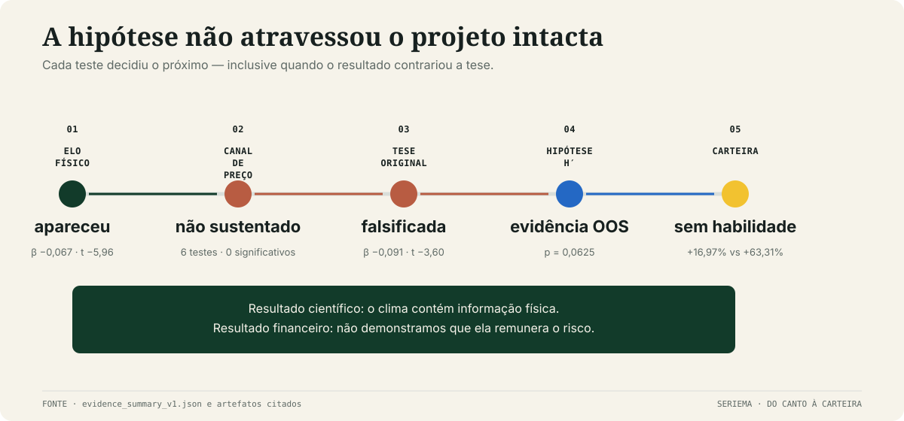
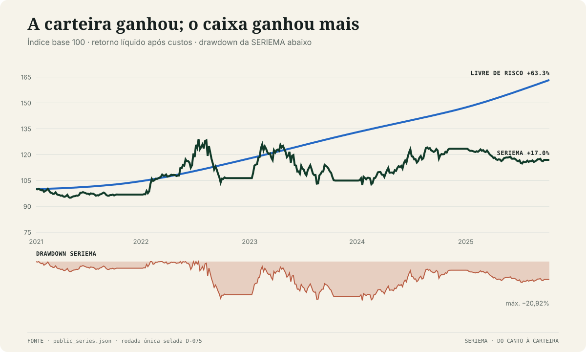
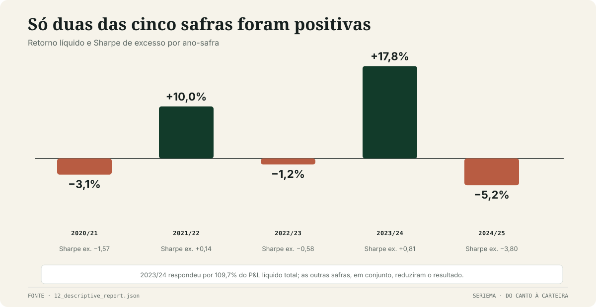
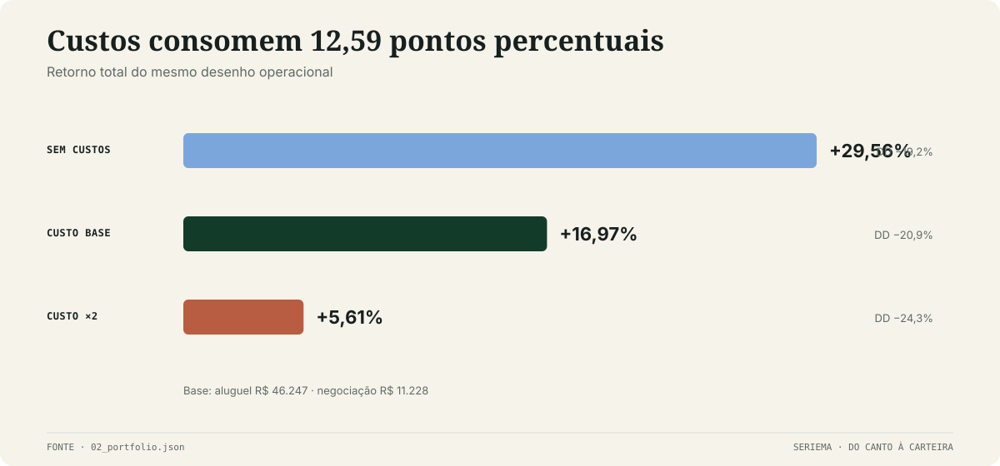
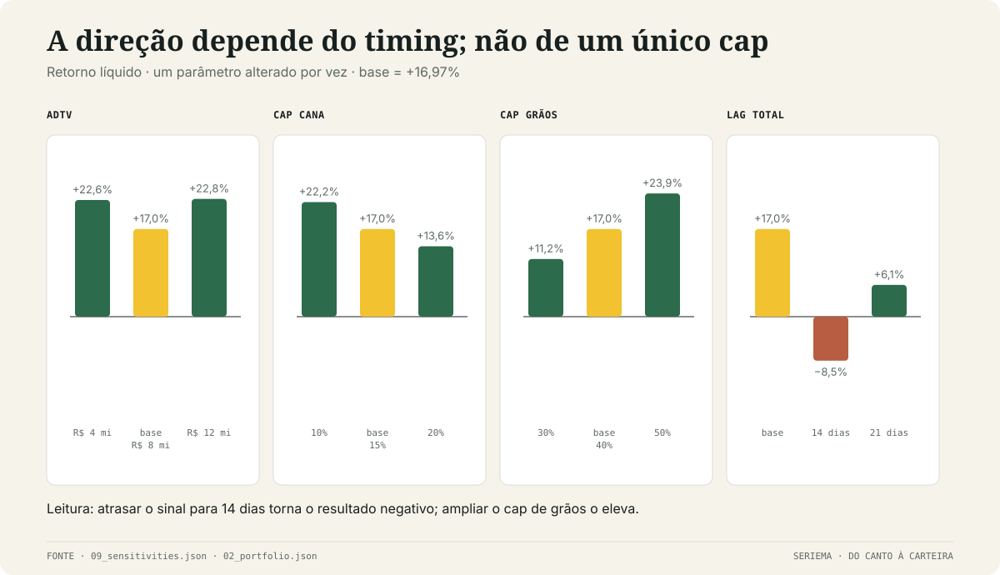
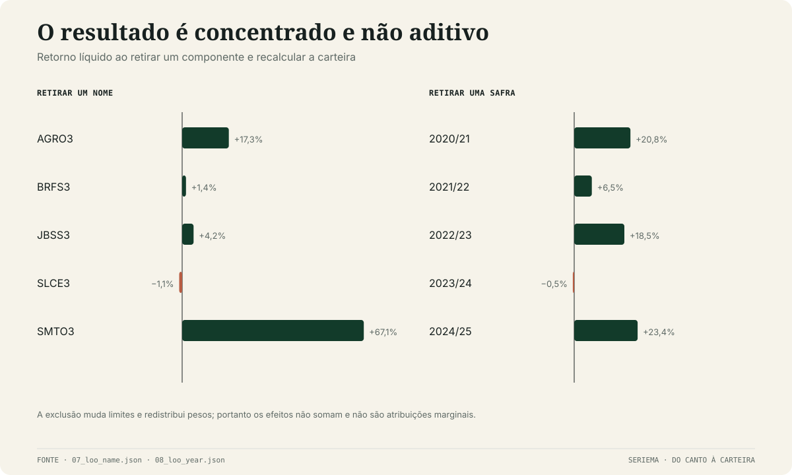
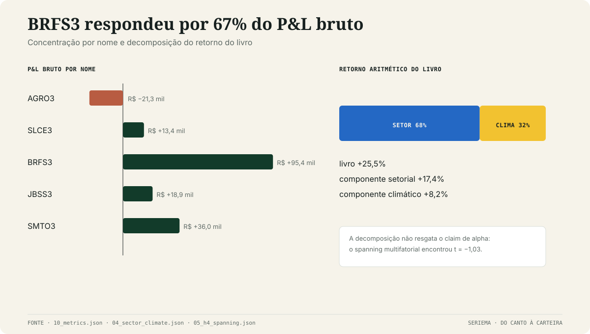

# Atlas de resultados

Este é o endereço canônico da evidência pública da SERIEMA. Ele amplia o relatório de cinco
páginas com cada teste relevante, sensibilidades e artefatos numéricos — sem transformar o PDF em
uma coleção de screenshots.

> **Leitura em uma frase:** houve evidência fora da amostra para H′ e P&L nominal positivo, mas não
> houve evidência de alpha climático nem de habilidade contra o livre de risco.

## 1. Como a evidência evoluiu



A estratégia final não foi a hipótese de partida. O percurso importa porque evita apresentar como
óbvio um sinal que só nasceu depois de um resultado contrário.

| Etapa | Pergunta | Resultado | Consequência |
|---|---|---|---|
| H1a/H1b | o choque de chuva antecipa revisão da CONAB? | sim, com ressalva de robustez | preserva o mecanismo físico |
| H2a + diagnósticos | menor oferta sustenta preço maior? | nenhuma das seis especificações estabeleceu o canal | preço não justifica comprar o produtor |
| reação acionária no dev | a direção original monetiza o choque? | **não**; β −0,091, `t` −3,60 | tese original falsificada |
| H′ Q-dominante | o dano de quantidade domina? | registrada como hipótese nova | direção produtor vendido / processador comprado |
| holdout | a nova regra sobrevive fora da amostra? | teste primário passou; carteira não bateu caixa | evidência da estratégia, sem habilidade demonstrada |

### 1.1 O elo físico

No painel completo de soja e milho segunda safra, H1a encontrou β agrupado **−0,0672**, `t`
**−5,96**, `N = 729` e oito clusters por safra. O sinal negativo é o esperado: maior déficit de
chuva antecede revisão mais negativa da produção.

A direção sobreviveu às quatro perturbações reais pré-registradas:

| Perturbação | β | |β| / |β base| | bootstrap `p` | Leitura |
|---|---:|---:|---:|---|
| climatologia encurtada | −0,0652 | 0,97 | 0,000 | passa |
| fonte climática final | −0,0922 | 1,37 | 0,000 | passa |
| disponibilidade +14 dias | −0,0689 | 1,02 | 0,000 | passa |
| janela agronômica +15 dias | −0,0512 | 0,76 | 0,000 | passa |
| placebo temporal | +0,0112 | 0,17 | 0,417 | morre como esperado |
| placebo espacial | −0,0207 | 0,31 | 0,019 | **não morre** |

Por isso, “H1 tem sinal estável” é permitido; “H1 é globalmente robusto” não é. O veredito formal
da suíte foi **NÃO ROBUSTO**, principalmente pelo placebo espacial residual e pela cobertura
limitada do grid real.

### 1.2 O canal de preço

A família H2 testou transmissão para preço mundial, diagnósticos contemporâneos/forward, câmbio e
preço local ao produtor. Nenhum dos seis testes deu suporte estatístico ao canal proposto. O último,
com preço local em BRL, teve a direção econômica esperada — β forward **+0,031** — mas pouco poder:
`t = 1,18` e bootstrap unilateral `p = 0,2148`.

Isso não prova que preço nunca reage a quebra de safra. Mostra que **esta amostra, estas medidas e
este protocolo não estabeleceram compensação suficiente para a tese acionária**.

### 1.3 Culturas adicionais

| Canal | Resultado | Decisão |
|---|---|---|
| algodão | β agrupado +0,0421, sinal oposto; 0/3 leave-one-out negativos | excluído do score |
| cana — maturação → ATR | β +0,0134; 8/8 LOO e 5/5 UFs positivas; `p = 0,12`, bootstrap `p = 0,27` | SMTO3 incluída com haircut e cap |
| cana — crescimento → produção | direção fraca e negativa | não usado como prova do canal |

A evidência de cana é direcional, não confirmatória. Ela entra com peso limitado e não recebe o
mesmo status do núcleo de grãos.

## 2. O teste final

A regra econômica, a mecânica de carteira e os seis inputs foram congelados antes da rodada. O
holdout 2020/21–2024/25 foi executado uma única vez em 27/07/2026.

| Elemento | Valor congelado |
|---|---|
| teste primário | permutação exata de 32 sign-flips, unilateral, α = 10% |
| unidade efetiva | cinco anos-safra |
| decisões | 46 blocos, 21 pregões no caso-base |
| universo | AGRO3, SLCE3, BRFS3, JBSS3, SMTO3 |
| execução | D+1, com liquidez, custos, aluguel e eventos corporativos |
| AUM | R$ 500 mil |
| benchmark primário | taxa livre de risco local |

### 2.1 H′ primária

H′ passou: estatística média **0,1665**, permutação unilateral `p = 0,0625`. Quatro de cinco
inclinações por safra foram positivas.

| Safra | Blocos | Inclinação H′ |
|---|---:|---:|
| 2020/21 | 9 | +0,4167 |
| 2021/22 | 9 | +0,0783 |
| 2022/23 | 9 | −0,0772 |
| 2023/24 | 10 | +0,0985 |
| 2024/25 | 9 | +0,3163 |

Esse teste responde se a regra cross-sectional congelada se relacionou aos retornos na direção de
H′. Ele **não** substitui a comparação econômica da carteira com o benchmark.

## 3. Resultado da carteira



| Métrica-base | Resultado |
|---|---:|
| retorno líquido nominal | **+16,97%** |
| livre de risco no mesmo intervalo | **+63,31%** |
| P&L líquido | R$ 84.870 |
| CAGR | +3,36% |
| volatilidade anualizada | 12,53% |
| Sharpe de excesso | **−0,50** |
| Sortino | −0,56 |
| drawdown máximo | **−20,92%** |
| maior período submerso | 809 sessões |
| pior sessão | −4,87% |
| VaR 95% / CVaR 95% | −1,24% / −1,92% |
| beta de mercado | +0,008 |

A neutralidade em dólares conteve beta direcional de mercado, mas não transformou baixo beta em
alpha. O custo de oportunidade dominou a carteira.

### 3.1 Safra por safra



| Safra | Retorno líquido | Sharpe de excesso | P&L | Leitura |
|---|---:|---:|---:|---|
| 2020/21 | −3,11% | −1,57 | −R$ 15,6 mil | negativo |
| 2021/22 | +10,00% | +0,14 | +R$ 48,3 mil | positivo, quase sem prêmio de risco |
| 2022/23 | −1,17% | −0,58 | −R$ 6,2 mil | negativo |
| 2023/24 | +17,76% | +0,81 | +R$ 93,1 mil | concentra o resultado |
| 2024/25 | −5,16% | −3,80 | −R$ 31,8 mil | pior Sharpe |

Somente duas de cinco safras foram positivas. 2023/24 respondeu por **109,7%** do P&L líquido
total; as outras quatro, em conjunto, reduziram o resultado.

## 4. Custos e investibilidade



| Cenário | Retorno | Drawdown | P&L líquido |
|---|---:|---:|---:|
| sem custos | +29,56% | −19,19% | R$ 147.819 |
| base | +16,97% | −20,92% | R$ 84.870 |
| custos ×2 | +5,61% | −24,28% | R$ 28.059 |

No cenário-base, aluguel consumiu R$ 46.247 e negociação à vista, R$ 11.228. A monotonicidade foi
preservada: mais custo sempre reduziu o patrimônio terminal.

O portão de liquidez não deixou a estratégia sem produtor: houve dois nomes produtores elegíveis
em 28 decisões e um nome em 18; nenhuma das 46 decisões ficou com zero produtor. A ramificação com
universo completo esteve ativa em 28 decisões.

## 5. Sensibilidade de parâmetros



Cada célula altera um único botão e mantém o restante do caso-base.

| Parâmetro | Variante baixa | Base | Variante alta | Leitura |
|---|---:|---:|---:|---|
| ADTV21 | R$ 4 mi: +22,58% | R$ 8 mi: +16,97% | R$ 12 mi: +22,79% | sinal positivo nos dois lados |
| cap de cana | 10%: +22,18% | 15%: +16,97% | 20%: +13,62% | maior cana reduz retorno |
| cap de grãos | 30%: +11,16% | 40%: +16,97% | 50%: +23,86% | maior grão eleva retorno |
| holding | 10 pregões: +17,46% | 21 pregões: +16,97% | — | estável nessa comparação |
| lag total | — | regra-base: +16,97% | 14 dias: −8,51%; 21 dias: +6,15% | timing é frágil |

O sinal de retorno não depende de um único cap, mas a mudança para lag total de 14 dias inverte o
resultado. Essa é uma limitação material, não um detalhe de tuning.

## 6. Leave-one-out



### 6.1 Retirar um nome

| Nome retirado | Retorno restante |
|---|---:|
| AGRO3 | +17,25% |
| BRFS3 | +1,42% |
| JBSS3 | +4,23% |
| SLCE3 | −1,10% |
| SMTO3 | +67,11% |

### 6.2 Retirar uma safra

| Safra retirada | Retorno restante |
|---|---:|
| 2020/21 | +20,77% |
| 2021/22 | +6,51% |
| 2022/23 | +18,52% |
| 2023/24 | −0,51% |
| 2024/25 | +23,44% |

Esses números não são contribuições marginais aditivas. Cada exclusão reexecuta limites e
redistribui pesos; por isso, por exemplo, retirar SMTO3 pode aumentar muito o retorno enquanto a
atribuição bruta de SMTO3 é positiva.

## 7. Atribuição e decomposição



| Nome | P&L bruto | Participação no P&L bruto |
|---|---:|---:|
| AGRO3 | −R$ 21,3 mil | −15,0% |
| SLCE3 | +R$ 13,4 mil | +9,4% |
| BRFS3 | +R$ 95,4 mil | **+67,0%** |
| JBSS3 | +R$ 18,9 mil | +13,3% |
| SMTO3 | +R$ 36,0 mil | +25,3% |

O HHI das participações absolutas foi 0,562; BRFS3 foi o maior componente. A decomposição opera
sobre o retorno **bruto e aritmético** do livro — 25,51%, e não os +16,97% líquidos e compostos da
seção 3, que já descontam custos. Esse bruto foi separado em **17,36% de setor** e **8,15% de
clima**: 32% do total para o componente climático.

Isso é diagnóstico, não prova de alpha. O spanning multifatorial estendido, com fatores NEFIN,
USD/BRL, soja, milho, açúcar e ONI, encontrou alpha anualizado aritmético **−5,99%**, `t = −1,03`
e `p` unilateral 0,848. H4 falhou.

## 8. Placebos e múltiplas tentativas

O placebo geográfico morreu como exigido: estatística −0,0153, `p = 0,5625` e magnitude absoluta
igual a 43,3% da real. A troca de exposições dentro de cada lado, porém, mostra que parte importante
da carteira vem da própria composição setorial; ela reforça a necessidade de não chamar o P&L de
alpha climático.

A correção por multiplicidade usou **39 tentativas**: as 16 decisões de desenho enumeradas no
`trial_ledger` mais 23 variantes executadas dentro da própria rodada (3 cenários de custo, 10
sensibilidades, 5 leave-one-name-out e 5 leave-one-year-out). O Deflated Sharpe Ratio foi 0,025.
Mesmo que H′ tenha sido registrada antes do holdout, a direção nasceu depois de observar a
falsificação no desenvolvimento; reportar a multiplicidade é indispensável.

## 9. Fronteira de claims

| Claim | Estado | Por quê |
|---|---|---|
| houve P&L OOS positivo | **permitido** | retorno líquido +16,97% |
| houve evidência OOS da estratégia | **permitido** | H′ primária `p = 0,0625` com α = 10% |
| o sinal climático demonstrou alpha | **vetado** | H4 falhou; alpha negativo e não significativo |
| houve habilidade contra o benchmark | **vetado** | Sharpe de excesso −0,50; caixa +63,31% |
| a estratégia é robusta em qualquer timing | **vetado** | lag de 14 dias produziu −8,51% |
| o mecanismo H1 é globalmente robusto | **vetado** | placebo espacial residual |

## 10. Artefatos e regeneração

Os resultados do holdout estão em [`data/holdout_v1/`](data/holdout_v1/); os testes de mecanismo,
em [`data/mechanism/`](data/mechanism/). O arquivo
[`evidence_summary_v1.json`](data/evidence_summary_v1.json) só organiza claims já presentes nessas
fontes e na trilha histórica.

As figuras são regeneradas com:

```bash
python scripts/build_public_figures.py
```

[`build_public_figures.py`](../scripts/build_public_figures.py) usa apenas a biblioteca padrão e os
artefatos públicos. A série compacta em
[`public_series.json`](data/holdout_v1/public_series.json) foi derivada uma vez dos métricos selados
e dos controles H4 com [`build_public_series.py`](../scripts/build_public_series.py); os parquets
completos continuam sujeitos à política de dados point-in-time.

Para a distinção entre verificar código, reconstruir uma captura nova e reproduzir bit a bit a
rodada v1, consulte [`REPRODUCING.md`](../REPRODUCING.md).
